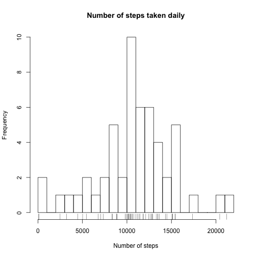
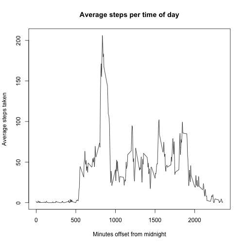
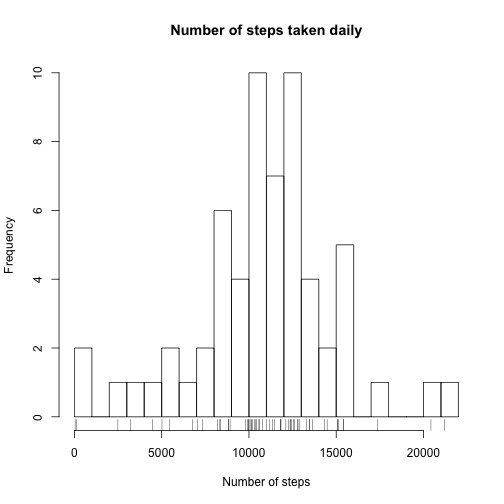
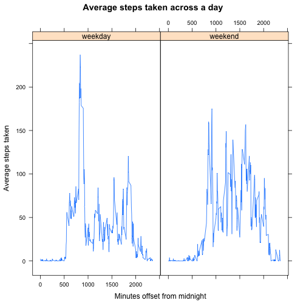

## Introduction

It is now possible to collect a large amount of data about personal movement using activity monitoring devices such as a Fitbit, Nike Fuelband, or Jawbone Up. These type of devices are part of the "quantified self" movement -- a group of enthusiasts who take measurements about themselves regularly to improve their health, to find patterns in their behavior, or because they are tech geeks. But these data remain under-utilized both because the raw data are hard to obtain and there is a lack of statistical methods and software for processing and interpreting the data.  

This assignment makes use of data from a personal activity monitoring device. This device collects data at 5 minute intervals through out the day. The data consists of two months of data from an anonymous individual collected during the months of October and November, 2012 and include the number of steps taken in 5 minute intervals each day.

## Loading and preprocessing the data
  
#### Data location, variables and observations

The data for this assignment can be downloaded from the course web
site:


* Dataset: [Activity monitoring data](https://d396qusza40orc.cloudfront.net/repdata%2Fdata%2Factivity.zip) [52K]

The variables included in this dataset are:

* **steps**: Number of steps taking in a 5-minute interval (missing
    values are coded as `NA`)

* **date**: The date on which the measurement was taken in YYYY-MM-DD
    format

* **interval**: Identifier for the 5-minute interval in which
    measurement was taken

The dataset is stored in a comma-separated-value (CSV) file and there
are a total of 17,568 observations in this dataset.
  
#### Retrieving the dataset.

We will download and unzip the data from the URL specified above (https://d396qusza40orc.cloudfront.net/repdata%2Fdata%2Factivity.zip), which we have saved in the variable `dataURL`.


```r
download.file(dataURL, destfile = "activitydata.zip", method="libcurl")
unzip("activitydata.zip")
```
  
#### 1. Load the data

This will place the file `activity.csv` in our working directory. We load this file into a variable named `activityData` for our further analysis. To show what we are working with we will have a look at the structure of the dataset. 


```r
activityData <- read.csv("activity.csv")
str(activityData)
```

```
## 'data.frame':	17568 obs. of  3 variables:
##  $ steps   : int  NA NA NA NA NA NA NA NA NA NA ...
##  $ date    : Factor w/ 61 levels "2012-10-01","2012-10-02",..: 1 1 1 1 1 1 1 1 1 1 ...
##  $ interval: int  0 5 10 15 20 25 30 35 40 45 ...
```

We will have a quick look at a sample of the data.


```r
head(activityData)
```

```
##   steps       date interval
## 1    NA 2012-10-01        0
## 2    NA 2012-10-01        5
## 3    NA 2012-10-01       10
## 4    NA 2012-10-01       15
## 5    NA 2012-10-01       20
## 6    NA 2012-10-01       25
```

Noticing that the `steps` column has many `NA` values, we'll quickly check that we do have some valid data for the `steps` column.


```r
summary(activityData$steps)
```

```
##    Min. 1st Qu.  Median    Mean 3rd Qu.    Max.    NA's 
##    0.00    0.00    0.00   37.38   12.00  806.00    2304
```

We do have data for `steps`, but there are **2304** rows with `NA` or about **13%** of our data is missing.

If we have a look at the data grouped by date, it looks as though there are periods (days) where there is no data recorded for the number of steps.


```r
tapply(is.na(activityData$steps), activityData$date, FUN=sum)
```

```
## 2012-10-01 2012-10-02 2012-10-03 2012-10-04 2012-10-05 2012-10-06 
##        288          0          0          0          0          0 
## 2012-10-07 2012-10-08 2012-10-09 2012-10-10 2012-10-11 2012-10-12 
##          0        288          0          0          0          0 
## 2012-10-13 2012-10-14 2012-10-15 2012-10-16 2012-10-17 2012-10-18 
##          0          0          0          0          0          0 
## 2012-10-19 2012-10-20 2012-10-21 2012-10-22 2012-10-23 2012-10-24 
##          0          0          0          0          0          0 
## 2012-10-25 2012-10-26 2012-10-27 2012-10-28 2012-10-29 2012-10-30 
##          0          0          0          0          0          0 
## 2012-10-31 2012-11-01 2012-11-02 2012-11-03 2012-11-04 2012-11-05 
##          0        288          0          0        288          0 
## 2012-11-06 2012-11-07 2012-11-08 2012-11-09 2012-11-10 2012-11-11 
##          0          0          0        288        288          0 
## 2012-11-12 2012-11-13 2012-11-14 2012-11-15 2012-11-16 2012-11-17 
##          0          0        288          0          0          0 
## 2012-11-18 2012-11-19 2012-11-20 2012-11-21 2012-11-22 2012-11-23 
##          0          0          0          0          0          0 
## 2012-11-24 2012-11-25 2012-11-26 2012-11-27 2012-11-28 2012-11-29 
##          0          0          0          0          0          0 
## 2012-11-30 
##        288
```
  
#### 2. Process / transform the data

We won't at this stage conduct any particular transformation of the data.

## What is the mean total number of steps taken per day?
  
#### 1. Calculate the total number of steps taken per day

Based on the days that we have data for, we can see the total number of steps taken per day as follows.


```r
dailySum <- aggregate(steps ~ date, data=activityData, sum)
dailySum
```

```
##          date steps
## 1  2012-10-02   126
## 2  2012-10-03 11352
## 3  2012-10-04 12116
## 4  2012-10-05 13294
## 5  2012-10-06 15420
## 6  2012-10-07 11015
## 7  2012-10-09 12811
## 8  2012-10-10  9900
## 9  2012-10-11 10304
## 10 2012-10-12 17382
## 11 2012-10-13 12426
## 12 2012-10-14 15098
## 13 2012-10-15 10139
## 14 2012-10-16 15084
## 15 2012-10-17 13452
## 16 2012-10-18 10056
## 17 2012-10-19 11829
## 18 2012-10-20 10395
## 19 2012-10-21  8821
## 20 2012-10-22 13460
## 21 2012-10-23  8918
## 22 2012-10-24  8355
## 23 2012-10-25  2492
## 24 2012-10-26  6778
## 25 2012-10-27 10119
## 26 2012-10-28 11458
## 27 2012-10-29  5018
## 28 2012-10-30  9819
## 29 2012-10-31 15414
## 30 2012-11-02 10600
## 31 2012-11-03 10571
## 32 2012-11-05 10439
## 33 2012-11-06  8334
## 34 2012-11-07 12883
## 35 2012-11-08  3219
## 36 2012-11-11 12608
## 37 2012-11-12 10765
## 38 2012-11-13  7336
## 39 2012-11-15    41
## 40 2012-11-16  5441
## 41 2012-11-17 14339
## 42 2012-11-18 15110
## 43 2012-11-19  8841
## 44 2012-11-20  4472
## 45 2012-11-21 12787
## 46 2012-11-22 20427
## 47 2012-11-23 21194
## 48 2012-11-24 14478
## 49 2012-11-25 11834
## 50 2012-11-26 11162
## 51 2012-11-27 13646
## 52 2012-11-28 10183
## 53 2012-11-29  7047
```
  
#### 2. Make a histogram of the total number of steps taken each day.


```r
hist(dailySum$steps, breaks=20, main="Number of steps taken daily", xlab="Number of steps")
rug(dailySum$steps)
```

 
  
#### 3. What is mean and median number of steps taken per day?

We will calculate the mean and median number of steps from the raw data.


```r
rawMean <- mean(dailySum$steps, na.rm=TRUE)
rawMedian <- median(dailySum$steps, na.rm=TRUE)
```

From this we get the raw mean as **10766.2** and the raw median as **10765**.

## What is the average daily activity pattern?
  
#### 1. Make a time series plot of the average number of steps taken


```r
avgSteps <- aggregate(steps ~ interval, data=activityData, mean, na.rm=TRUE)
plot(steps ~ interval, data=avgSteps, type="l", main="Average steps per time of day", xlab="Minutes offset from midnight", ylab="Average steps taken")
```

 
  
#### 2. Which 5-minute interval on average contains the most steps?


```r
maxSteps <- max(avgSteps$steps)
maxInterval <- avgSteps[which.max(avgSteps$steps), ]$interval
maxHours <- floor(maxInterval / 60)
maxMins <- maxInterval - (60*maxHours)
```

The maximum average number of steps for any 5-minute period was **206.17** which occured at the interval **835**, which equates to **13:55** in 24-hr time.

## Imputing missing values

As observed earlier there are a number of days with only `NA` values submitted.
  
#### 1. Calculate and report the total number of missing values in the dataset.


```r
naCount <- nrow(activityData[is.na(activityData$steps), ])
```

The total number of missing values in the dataset is 2304.
  
#### 2. Devise a strategy for filling in the missing values.

To fill in the missing values, we will impute the data based on the mean values for each 5-minute interval from the same 5-minute interval on the same day of the week.  For example, we will impute the value for a missing observation on a Wednesday at 12:00pm (an interval of 720) as the average of all readings on Wednesdays at 12:00pm.
  
#### 3. Create the new dataset with missing values filled in

There are several steps to this process, as shown below.


```r
# Copy the dataset so we can come back to the original one if we need to
newActivityData <- activityData

# Add the weekday for us in our imputation
newActivityData$weekday <- weekdays(as.POSIXct(newActivityData$date))

# Calculate the weekday intervalu averages
weekdayIntervalAvgs <- aggregate(steps ~ weekday + interval, data=newActivityData, FUN=mean, na.rm=TRUE)

# Create a function to pull the mean value from the weekly interval averages
# when supplied with the weekday and interval
impute.mean <- function(weekday, interval) {
    imputedMean <- weekdayIntervalAvgs[weekdayIntervalAvgs$weekday == weekday & weekdayIntervalAvgs$interval == interval, ]$steps
    imputedMean
}

# Now apply this function to each row of our new dataset to fill in the values
for(i in 1:nrow(newActivityData)) {
    if(is.na(newActivityData[i, ]$steps)) {
        newActivityData[i, ]$steps <- impute.mean(newActivityData[i, ]$weekday, newActivityData[i, ]$interval)
    }
}
```

We'll do a quick check to make sure all `NA`s have been removed.


```r
summary(activityData$steps)
```

```
##    Min. 1st Qu.  Median    Mean 3rd Qu.    Max.    NA's 
##    0.00    0.00    0.00   37.38   12.00  806.00    2304
```

```r
summary(newActivityData$steps)
```

```
##    Min. 1st Qu.  Median    Mean 3rd Qu.    Max. 
##    0.00    0.00    0.00   37.57   19.04  806.00
```

We can see there are now no `NA`s in the new data set.
  
#### 4. Make a histogram of the number of steps.


```r
dailySum2 <- aggregate(steps ~ date, data = newActivityData, sum)
hist(dailySum2$steps, breaks=20, main="Number of steps taken daily", xlab="Number of steps")
rug(dailySum2$steps)
```

 
  
#### 4.b. Calculcate the new mean and median, and compare to the previous estimates

We will calculate the mean and median number of steps from the raw data.


```r
filledMean <- mean(dailySum2$steps, na.rm=TRUE)
filledMedian <- median(dailySum2$steps, na.rm=TRUE)
```

The new mean is 10821.21 and the new median is 11015.00.  Imputing values has had the effect of raising both the mean and median as more data was added, all of which was positive (or zero).


```r
require(knitr)
meanMedians <- matrix(c(rawMean, filledMean, rawMedian, filledMedian), nrow=2, ncol=2, byrow=TRUE, dimnames = list(c("Mean", "Median"), c("Raw", "Imputed")))
kable(meanMedians, digits=2)
```


|       |      Raw|  Imputed|
|:------|--------:|--------:|
|Mean   | 10766.19| 10821.21|
|Median | 10765.00| 11015.00|

## Are there differences in activity patterns between weekdays and weekends?

We will have a look at weekday activity vs weekend activity.  We would expect there to be some difference to the time-of-day profile of activity.

#### 1. Create a new factor variable to hold 'weekday' or 'weekend'

We can use the modulo `%%` operator and the fact that the wday value from a POSIXlt date will return a 0 for Sunday and 6 for Saturday to identify the weekend days, as only they (0 or 6) modulo 6 will equal 0 - all weekdays will have a remainder.

```r
newActivityData$dayType <- as.factor(ifelse(as.POSIXlt(newActivityData$date)$wday %% 6 == 0, "weekend", "weekday"))
```

Do a quick check to make sure this looks reasonable.

```r
table(newActivityData$weekday, newActivityData$dayType)
```

```
##            
##             weekday weekend
##   Friday       2592       0
##   Monday       2592       0
##   Saturday        0    2304
##   Sunday          0    2304
##   Thursday     2592       0
##   Tuesday      2592       0
##   Wednesday    2592       0
```
  
#### 2. Make a panel plot showing time series of weekday v weekend steps taken


```r
require(lattice)
avgSteps2 <- aggregate(steps ~ interval + dayType, data=newActivityData, mean)
xyplot(steps ~ interval | dayType, data=avgSteps2, type="l", main="Average steps taken across a day", xlab="Minutes offset from midnight", ylab="Average steps taken")
```

 

